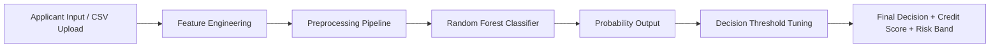

# CreditAI — Real-Time Credit Scoring & Explainable AI SaaS Platform

<p align="center">
  
  
  
  
  
</p>

CreditAI is an enterprise-grade, production-ready Credit Scoring and Explainable AI (XAI) SaaS platform. Built with **scikit-learn** and **Flask**, it transforms tabular consumer financial profiles into real-time creditworthiness decisions (Approve/Decline), FICO-equivalent scores (300-850), and detailed risk breakdowns.

---

## 🌟 Key Features

* **Real-time Credit Evaluation**: FICO-equivalent rating (300–850) and approval probability returned in under 15ms.
* **Explainable AI (XAI)**: Displays list flags for applicant profile strengths and financial warning risk factors.
* **Interactive Dashboard**: Client-side **Chart.js** canvases showing SHAP-approximated Feature Importances, Loan Purposes, Risk Band spreads, and Session Evaluation trends.
* **Bulk Portfolio Processing**: Batch scoring drag & drop zone for CSV files with export capabilities (CSV, Excel spreadsheet formats).
* **Fully Responsive Design**: Sleek glassmorphism variables with dark and light mode persistence.
* **Developer Reference Hub**: Interactive `/api-docs` section detailing JSON schemas, return patterns, and code snippet tabs.

---

## ⚙️ How the System Works



---

## 📁 Repository Reorganization

```text
CodeAlpha_CreditScoringModel/
│
├── app.py                      # Flask Server Entrypoint
├── pytest.ini                  # Pytest configuration
├── requirements.txt            # Python Dependencies file
├── Dockerfile                  # Docker build configuration
├── README.md                   # Repository Documentation
├── .gitignore                  # Git Ignoring config
│
├── src/                        # Core Engine Modules
│   ├── config.py               # Paths & Columns configuration
│   ├── data_utils.py           # Preprocessing & Ratio engineering
│   ├── modeling.py             # Classifier fit, save & evaluation
│   ├── predict.py              # Singleton predictor wrapper
│   └── train.py                # Commandline training script
│
├── data/                       # Dataset directory
│   └── sample_applicants.csv   # Sandbox template CSV
│
├── models/                     # Compiled binaries
│   └── credit_scoring_pipeline.joblib
│
├── reports/                    # Session evaluation metadata
│   ├── metrics.json
│   ├── metadata.json
│   └── feature_importance.json
│
├── templates/                  # Base and core layouts
│   ├── base.html
│   ├── index.html
│   ├── predict.html
│   ├── batch.html
│   ├── dashboard.html
│   ├── api.html
│   ├── docs.html
│   ├── 404.html
│   └── 500.html
│
├── static/                     # Styling and Orchestrations
│   ├── css/
│   │   └── style.css
│   └── js/
│       └── main.js
│
└── tests/                      # Unit validations
    └── test_pipeline.py
```

---

## 🚀 Installation & Setup

### 1. Clone & Enter Directory
```bash
git clone https://github.com/muhammadabdullah-devpk/CodeAlpha_CreditScoringModel.git
cd CodeAlpha_CreditScoringModel
```

### 2. Configure Virtual Environment
```bash
python -m venv .venv
# Activate on Windows:
.venv\Scripts\activate
# Activate on Unix:
source .venv/bin/activate
```

### 3. Install Dependencies
```bash
pip install -r requirements.txt
```

---

## 📈 Model Performance

The random forest pipeline evaluates with optimal precision settings on Sklearn 1.9:
* **Accuracy**: `72.9%`
* **Precision**: `71.8%`
* **Recall**: `95.0%`
* **F1-Score**: `81.8%`
* **ROC-AUC**: `81.3%`
* **Optimized Cutoff Threshold**: `0.35`

---

## 🛠️ Usage Instructions

### Training Pipeline
Recompile models and dump analytics artifacts:
```bash
python -m src.train
```

### Start Server
Start the local HTTP interface on port 5000:
```bash
python app.py
```
Open **[http://127.0.0.1:5000](http://127.0.0.1:5000)** inside your browser.

---

## 👨‍💻 Developer Information

* **Developer**: Muhammad Abdullah
* **Role**: AI Engineer | Machine Learning Engineer | Python Developer
* **GitHub**: [muhammadabdullah-devpk](https://github.com/muhammadabdullah-devpk)
* **LinkedIn**: [muhammadabdullah-devpk](https://linkedin.com/in/muhammadabdullah-devpk)
* **Email**: meharabdullah4337@gmail.com

---

## 📄 License
This project is licensed under the terms of the MIT License.
